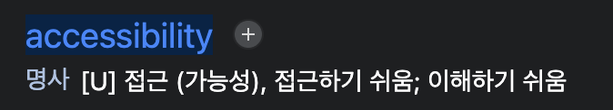
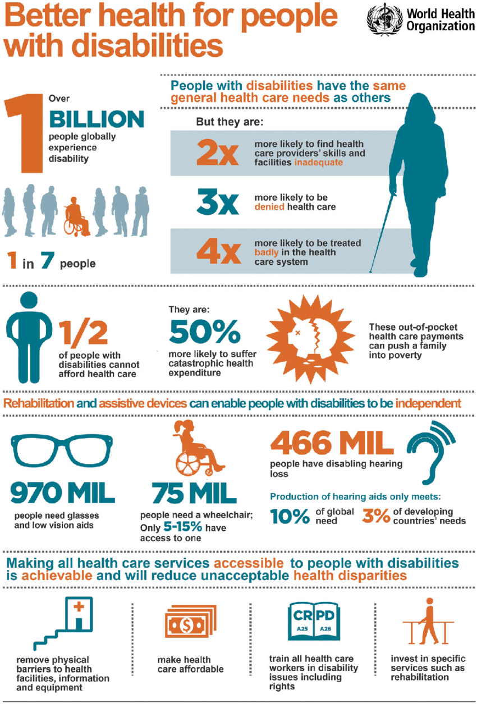
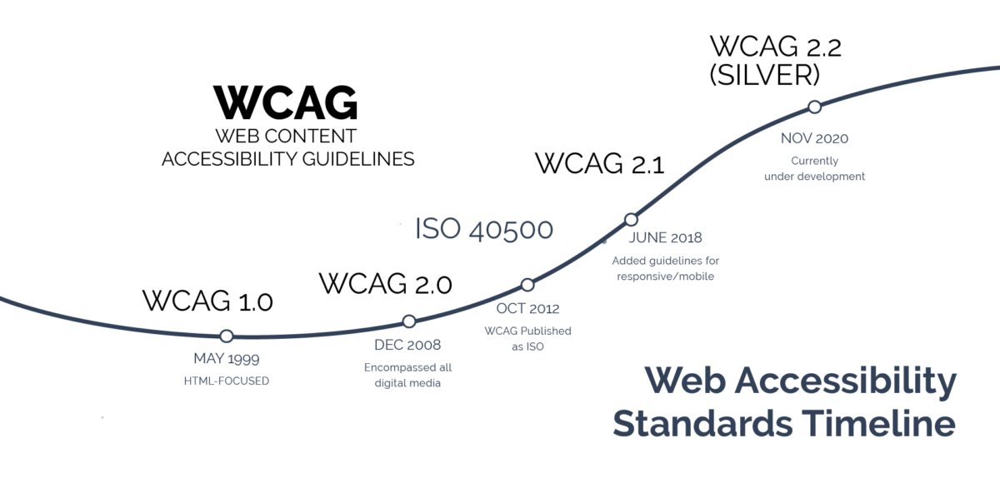

<!-- .slide: class="title absolute" -->

# Web Accessibility <!-- .element: style="top: 80px; left: 120px;" -->

### Presenter: Min Kyu Lee <!-- .element: style="bottom: 80px; right: 100px;" -->

---

<!-- .slide: class="header content" -->

# Why Accessibility?

> The power of the Web is in its universality.<cite>- Tim Berners-Lee, Inventor of the World Wide Web</cite>

 <!-- .element: style="height: 360px" -->

---

<!-- .slide: class="header content" data-auto-animate -->

# Why Accessibility?

## 접근성이란?

사전적 정의:

 

 <!-- .element: class="fragment" style="height: 80px" -->

---

<!-- .slide: class="header content" data-auto-animate -->

# Why Accessibility?

## 접근성이란?

WSC에 따르면,

 

- 콘텐츠(웹)가 장애인을 포함한 모든 사람들이 사용할 수 있도록 설계되는 것 <!-- .element: class="fragment" -->
- 아래의 장애를 모두 포함 <!-- .element: class="fragment" -->
  - 청각
  - 인지
  - 신경
  - 물리
  - 말하기
  - 시각

---

<!-- .slide: class="content" -->

 <!-- .element: style="height: 572px;" -->

---

<!-- .slide: class="header content" -->

# Why Accessibility?

접근성을 향상시키는 것은 장애가 없는 사람들에게도 도움이 됨
- 화면이 작은 스마트폰으로 보는 사람들 <!-- .element: class="fragment" -->
- 햇빛이 너무 밝아서 화면을 보기 어려운 사람들 <!-- .element: class="fragment" -->
- 너무 시끄럽거나 조용한 공간이라 소리를 들을 수 없는 사람들 <!-- .element: class="fragment" -->
- 노화로 인해 감각이 둔화되는 사람들 <!-- .element: class="fragment" -->
- 팔이 부러지는 등 일시적 장애를 갖는 사람들 <!-- .element: class="fragment" -->
- 인터넷이 너무 느린 사람들 <!-- .element: class="fragment" -->

---

<!-- .slide: class="header content" -->

# 접근성 표준

- WCAG (Web Content Accessibility Guidelines)
- ATAG (Authoring Tool Accessibility Guidelines) <!-- .element: class="fragment semi-fade-out" data-fragment-index="1" -->
- UAAG (User Agent Accessibility Guidelines) <!-- .element: class="fragment semi-fade-out" data-fragment-index="1" --->

---

<!-- .slide: class="header content" -->

# 접근성 표준

 <!-- .element: style="background: white; height: 400px;" -->

---

<!-- .slide: class="header content" -->

# 접근성 표준

